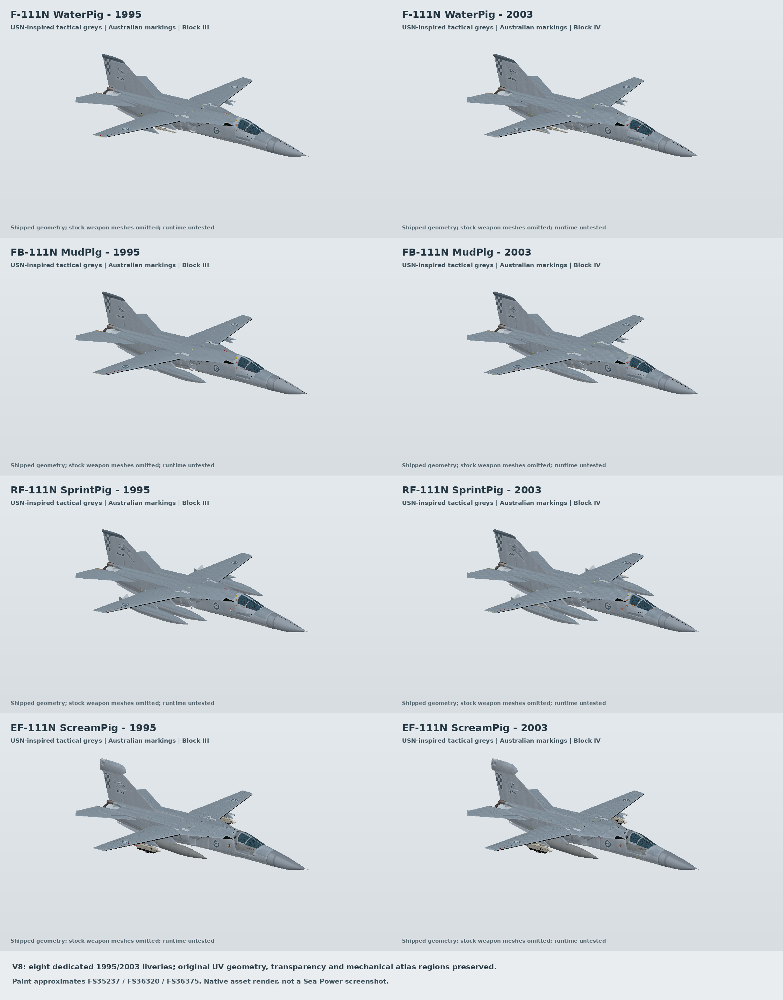

# RAN F-111N Naval Wing V8

**Version 8 internal-bay update — 2 October 2026.** MudPig gains 44 bay mission fits and extra internal stores on existing bombing, precision, Maverick, Shrike, SLAM and JDAM presets. The release now has 211 presets. Original bay stations, doors and carrier/landing geometry are retained; armed launch/recovery still requires in-game testing.

**Version 8.** All release labels, filenames, installer messages, previews and Workshop text now use V8. This release carries the existing verified aircraft and installation fixes: four aircraft families in 1980, 1985, 1995 and 2003 editions; 16 aircraft and 211 selectable presets.

- [Download the complete V8 mod and source ZIP](https://github.com/gobertron/Seapower-F111N/archive/refs/heads/main.zip)
- [Standalone replacement and Workshop preparation script](replace-f111n-with-v8.sh) · [Replacement instructions](docs/REPLACE_WITH_V8.md) · [Steam upload instructions](docs/STEAM_WORKSHOP_UPLOAD.md)
- [Checksums for every game file](MOD_SHA256.txt)
- [Complete breakdown: all aircraft, presets, weights and references](docs/V8-Complete-Breakdown.md)
- [Sortable list of every loadout](ALL_LOADOUTS_V8.csv)
- [Expanded internal bay, capacity and armed recovery test](docs/INTERNAL_BAY_V8.md)
- [Steam Workshop description](WORKSHOP_DESCRIPTION.txt) and [V8 update notes](WORKSHOP_UPDATE_NOTES_V8.txt)
- [All sixteen aircraft compared](docs/AIRCRAFT_COMPARISON.md) and [investment/system upgrades](docs/INVESTMENT_PROGRAMME.md)

**V8 corrections (1 October 2026):** all 61 custom weapon/store names use the native ammunition table; all 16 aircraft use zero-reload chaff; the carrier installer accepts Windows-encoded source INIs and repairs stale lift/taxi references using existing carrier geometry. The standalone replacement script keeps dated backups. All 18 replacement/recovery tests and six lift-repair tests passed, including representative Majestic Elevator3/Elevator4 failures.

The repository includes the complete aircraft assets, native configuration, installers, authoring source, previews and validation reports. The GitHub ZIP includes the complete mod tree, expanded publication breakdown and Workshop text. Game assets match the validated standalone V8 release.

**Verification:** 35,186 mod checks, 2,243 carrier/installer checks and eight late texture audits passed. In-game gun fire, guidance/release, flight performance, ECM display, date filtering and carrier landings remain untested. This is an alternate-history programme with documented native simulation limits.

An alternate-history Australian carrier F-111 programme for **Sea Power**: four original roles in **1980, 1985, 1995 and 2003** editions. This fresh V8 is built from the saved V6 base and contains **16 aircraft and 211 loadout presets**, progressive propulsion/mission-system investment, period weapons and eight dedicated late-edition grey liveries.

## Four families

| Aircraft | Primary role | Main equipment | Configured maximum |
|---|---|---|---:|
| F-111N WaterPig | Fleet defence/interception | IR/BVR/Phoenix missiles, M61 and long-range tanks | Mach 2.5 |
| FB-111N MudPig | Maritime/land-strike all-rounder | Other families' period weapon types, Harpoon, bombs, stand-off weapons, EW/SEAD/recon fits and M61 | Mach 2.6 |
| RF-111N SprintPig | Fast reconnaissance/ELINT | Defensive IR missiles, M61, four tanks or clean sprint | Mach 3.0 |
| EF-111N ScreamPig | Dedicated electronic attack/SEAD | Two physical pylon ECM pods, two offensive ECM systems, defensive missiles and tanks/ARMs | Mach 2.2 |

F/FB/RF each have a fixed forward M61 with 2,000 rounds. EF retains its dedicated EW fit without a gun. RF has Mach 2.52 cruise and three times WaterPig's velocity/thrust response gains for the same edition. That does not mean three times the other aircraft's maximum airspeed; its high-thrust Mach 3 package is fictional.

## Australian investment

| Edition | Upgrade | Non-RF afterburning thrust per engine | Response versus 1980 | Control gains versus 1980 |
|---|---|---:|---:|---:|
| 1980 | Block I: initial naval programme | 82.30 kN | 1.00× | 1.00× |
| 1985 | Block II: TF30 uprating/digital weapons | 90.53 kN | 1.10× | 1.05× |
| 1995 | Block III: F110-GE-400-class adaptation/digital mission suite | 120.00 kN | 1.25× | 1.10× |
| 2003 | Block IV: F110-GE-129-class adaptation/networked precision | 129.00 kN | 1.40× | 1.15× |

These are native settings for a heavily funded hypothetical Australian programme. Radar channels/range/gain/resolution, FLIR, RWR/ELINT, offensive/defensive EW, climb response, nominal cruise range and weapon readiness also improve. The separate Phoenix targeting donor keeps six target and six weapon channels. [The full investment comparison](docs/INVESTMENT_PROGRAMME.md) lists the actual settings.

The TF30 reference and F110 thrust classes are separated from estimated F-111 adaptation, dry thrust, retrofit weights and mission-system ratings. Original cockpit/model geometry is retained; no new interactive MFD cockpit or custom flight DLL is added.

## Period weapons

| Edition | Air-to-air | Harpoon | Main strike/SEAD additions |
|---|---|---|---|
| 1980 | AIM-9L, AIM-7F, AIM-54A | AGM-84A | GP bombs, Paveway II, Maverick B, Shrike, Standard ARM |
| 1985 | AIM-9M, AIM-7M, AIM-54C | AGM-84C | Maverick D, HARM A, GBU-15, Paveway III |
| 1995 | AIM-9M, AIM-120B, AIM-54C | AGM-84D | Maverick G, HARM C, Popeye, SLAM |
| 2003 | ASRAAM, AIM-120C-5, AIM-54C | AGM-84L Block II | SLAM-ER, JDAM GBU-31/32, AGM-154A JSOW |

Later MudPig versions retain older bombing options. Procurement, wiring, software, pylon engineering and trials are assumed. Early 1985 Phoenix C/HARM/Paveway III, 1995 Popeye and 2003 ASRAAM/Block II represent accelerated integration; actual Australian service/export approval/F-111 certification is not asserted.

| MudPig anti-ship preset | External stores | Original internal bay |
|---|---|---|
| Standard | 2 defensive IR missiles + 2 Harpoons | Empty |
| Heavy | 4 Harpoons | 3 Harpoons |
| Long range | 2 defensive IR missiles + 2 Harpoons + 2 tanks | 3 Harpoons |

Missile variants follow the edition. The bay's three stations, concealment and door animations remain exact. The separate fictional M61 installation does not consume the bay; historical F-111 gun placement did use bay space. No new exterior gun fairing is drawn. Laser/EO control pods use counted external stations. MudPig's offensive ECM containers are removable for EW fits.

The expanded bay also carries three Mk 82s, or two Mk 83/Mk 84/GBU-12 bombs, Mavericks, Phoenix missiles, later SLAMs or 2003 GBU-31/32 JDAMs. New `AntiShipBay`, `StrikeBay`, `StrikeHeavyBay`, `StrikePrecisionBay` and `FleetInterceptBay` fits each have a two-tank `LongRange` companion; 2003 also adds `JDAMBay` and `JDAMHeavyBay` pairs. Phoenix uses the dedicated air-targeting controller. Single-store suspension offsets accommodate Phoenix/Shrike native geometry without adding stations.

Estimated bay adapters and interfaces add 40/50/60/75 kg to MudPig empty mass across the four editions, alongside existing propulsion and mission-system investment. Coarse stowage, counts, targeting, attack modes and full-fuel mass budgets are checked. The takeoff reference does not certify a carrier landing weight or armed recovery. See the [bay guide](docs/INTERNAL_BAY_V8.md) for every loaded-bay fit and the runtime test sequence.

## Weights and paint

All aircraft use 14,897 kg internal fuel. Each 600-US-gallon tank adds 1,770 kg fuel and an estimated 150 kg shell; gun ammunition adds 544 kg. Naval, gun, role, systems, propulsion and RF thermal allowances are explicit estimates above the basic F-111C reference. The heaviest full-fuel fit is RF 2003 with four tanks at **50,897 kg**, 948 kg below the 51,845 kg takeoff reference. This mass budget does not certify carrier suitability.

All eight 1995/2003 models have USN-inspired darker-upper/intermediate-side/light-under tactical greys approximating FS35237/36320/36375. Australian roundels, NAVY text, A8 serials, badges and subdued checks remain. Tanks and UI profiles match; 2003 has modest extra wear. Original UVs, alpha, protected cockpit/mechanical areas, normal/specular maps, earlier liveries, meshes and landing animations are preserved. See [texture notes](TEXTURE_AUTHORING_NOTES.md) and [both-side lettering](lettering_both_sides_V8.png).

## Install and use

1. Close Sea Power and extract the complete ZIP.
2. From the extracted folder containing the installer, run `bash install-ran-f111n.sh`.
3. Enable **RAN F-111N Naval Wing V8**, disable older Naval Wing copies and give V8 priority over carrier mods. Keep source carrier mods enabled for assets.
4. Restart and add your chosen dated aircraft to the carrier air group in the mission editor.

For a specific Steam install: `bash install-ran-f111n.sh "/full/path/to/steamapps/common/Sea Power"`. An optional second argument selects a preferred carrier mod folder. The installer stages/verifies the update, backs up recognised earlier local versions outside StreamingAssets and creates carrier overrides without editing source/Workshop files. It works through bash from fish; an existing Anchor Chain setup can remain enabled. Rerun after carrier-mod updates.

Windows/manual: run `python carrier_compatibility.py "C:\path\to\Sea Power"`, then copy `RAN-F111N-Naval-Wing` into `Sea Power_Data/StreamingAssets/user/` and enable V8 with carrier priority.

All 16 IDs retain carrier capability. Stock, RAN and custom decks are discovered, including nonstandard carrier names and the existing fictional helicopter-deck arrested recovery conversion. Existing air groups and helicopter/VTOL approaches are preserved. Actual installed landings still need checking in-game.

Unsuffixed IDs are 1980; later IDs end `_1985`, `_1995`, `_2003`. Service gates are 1980–1984, 1985–1994, 1995–2002 and 2003–2050. Existing saved missions using old IDs select 1980 equipment. For RF sprint, use `ReconFast` and independent orders above 37,000 ft; a formation leader may limit speed. Mach settings do not force AI speed.

## Complete information

- [All sixteen aircraft comparison](docs/AIRCRAFT_COMPARISON.md)
- [Full investment/system settings](docs/INVESTMENT_PROGRAMME.md)
- [Every loadout, store and mass budget](COMPLETE_BREAKDOWN_V8.md), plus [sortable CSV](ALL_LOADOUTS_V8.csv)
- [Aircraft/loadout JSON](loadout_manifest.json), [investment JSON](investment_manifest.json), [61 local store definitions](weapon_catalog.json)
- [Release notes/test results](RELEASE_NOTES_V8.md), [changelog](CHANGELOG.md), [Steam BBCode description](WORKSHOP_DESCRIPTION.txt)
- [Historical references](HISTORICAL_REFERENCES.md), [authoring commands](authoring/AUTHORING.md), [credits/rights](THIRD_PARTY_CREDITS.md), [V6 build provenance](BUILD_PROVENANCE.json)

Native modern-weapon approximations remain: AMRAAM has no platform midcourse correction; ASRAAM adds no helmet sight/LOAL; EO weapons add no manual retargeting; Block II Harpoon models ship attack; **JDAM/JSOW use native CEP/ballistic/glide approximations, not full GPS/INS guidance**. AWG-9/APQ-161 donors represent the fictional radar programme; a digital radar label is not a new simulation engine.

Static aircraft, texture and carrier/installer checks are supplied. **Sea Power is not installed in this build environment:** gun fire, guidance/release, Mach 3 flight, ECM display, date filtering and actual landings remain untested in-game. Third-party assets retain their original rights; no new blanket licence is assigned to them.
